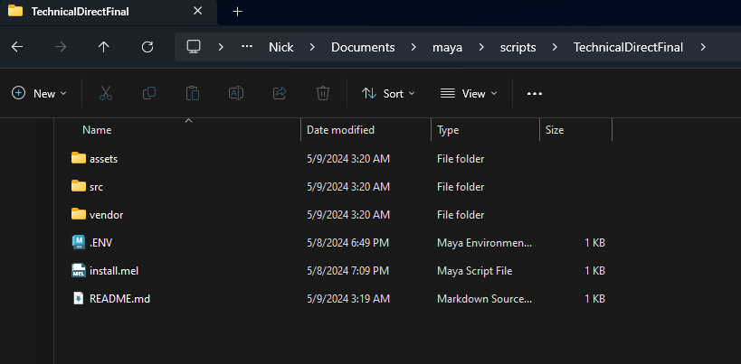
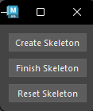
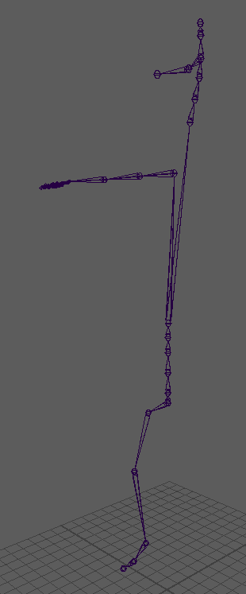
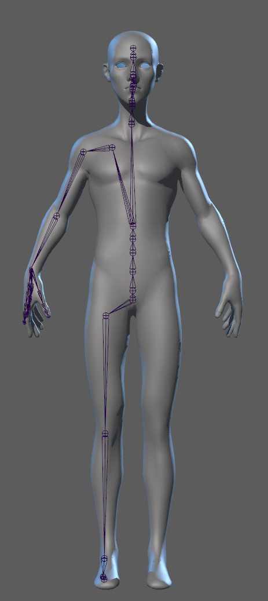
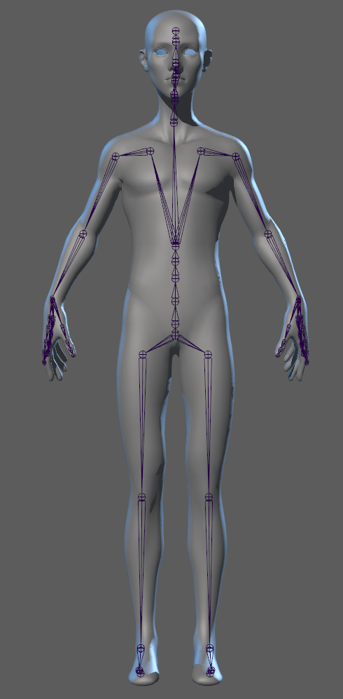

# TechnicalDirectFinal
### Introduction
The most annoying thing I found about rigging was putting points joints down. I wanted to see if I could automate it a bit like it was in the auto-rigger we used.
# How To Install
- Download and unzip the plging into the maya script folder, it should look like this

- Then just drag the install.md into maya
# IMPORTANT
- notice that the file is not within a specific version of maya. Instead, it's in the general scripts folder in maya (file path is C:\Users\UserName\Documents\maya\scripts\TechnicalDirectFinal). If you place it within a specific versions files it will not work.

# How To Use
- Clicking on the plugin icon opens this menu

- clicking Create Skeleton creates this rig within maya

- Move the skeleton to match the players body

- press the Finish Skeleton button

- It does some basic skin weighting, but feel free to edit it to be more precise to what you want
- If you want to edit the skeleton a bit hit Reset Skeleton, make your changes, and hit finish again.
    - Any changes to skin weight will not be saved